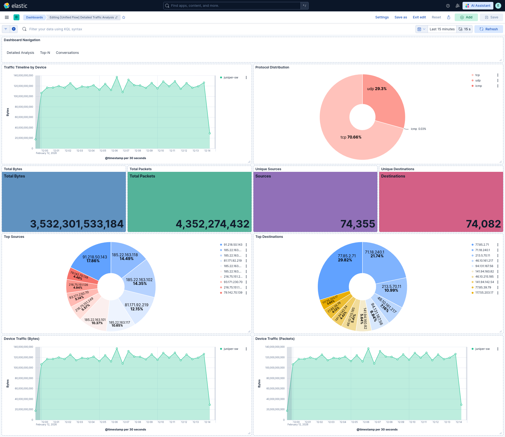
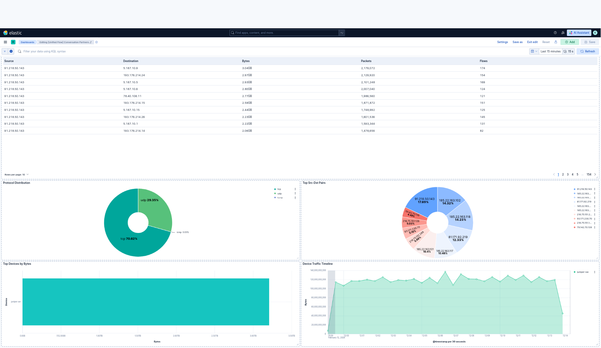
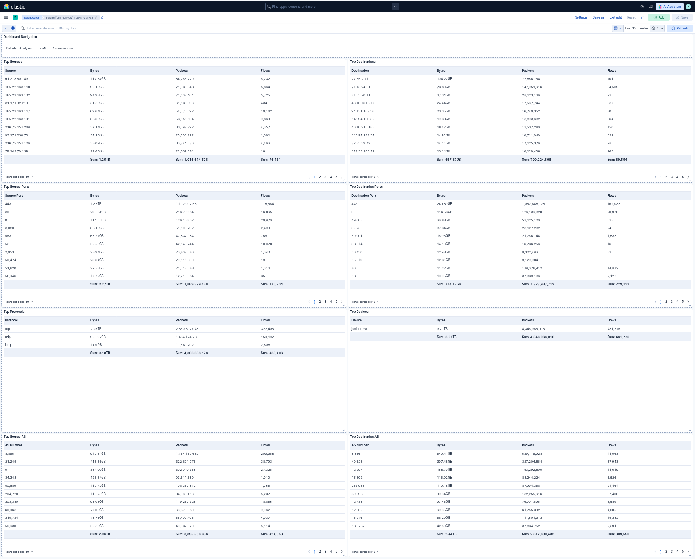

# ELK Stack with NetFlow & sFlow Monitoring

Distributed ELK deployment with NetFlow (Juniper) and sFlow (Cisco Nexus) support.

**SECURITY WARNING:** See [SECURITY.md](SECURITY.md) - Change all default passwords before use!


## Architecture

```
Frontend (10.4.4.87)
├── Elasticsearch (master role)
├── Kibana UI (port 5601)
└── .env configuration

Backend N1 (10.4.4.21) - NetFlow
├── Logstash (UDP 2050)
└── Elasticsearch (data node)

Backend N2 (10.4.4.90) - sFlow
├── Logstash (UDP 6343)
└── Elasticsearch (data node)

Network Devices
├── Juniper (NetFlow v9) → Backend N1:2050
└── Cisco Nexus (sFlow) → Backend N2:6343
```

## Prerequisites

- 3 servers with Docker & Docker Compose
- Ubuntu/Debian with SSH access
- Network devices configured for flow export
- TLS certificates generated

## Quick Start (Recommended - Automated Deployment)

Use the unified deployment script for automatic setup:

```bash
# 1. Clone the repository
git clone https://github.com/ViktorPetrov0605/custom-elk-stack.git
cd custom-elk-stack

# 2. Generate configuration template
./deploy.sh --generate

# 3. Edit configuration with your settings
nano deploy.conf
# - Set passwords (ELASTIC_PASSWORD, KIBANA_PASSWORD)
# - Configure IPs (FRONTEND_IP, BACKEND_*_IP)
# - Add as many backends as needed
# - Generate encryption keys: openssl rand -hex 32

# 4. Run the deployment
./deploy.sh
```

The script will:
- Check prerequisites on all servers
- Generate SSL certificates automatically
- Deploy the frontend (Kibana + Elasticsearch masters)
- Deploy all configured backends (Elasticsearch data + Logstash)
- Apply ILM policy for 1-day data retention
- Import Kibana dashboards
- Verify the deployment

### Deploy Script Options

```bash
./deploy.sh -h              # Show help
./deploy.sh -c              # Check prerequisites only
./deploy.sh -f              # Deploy frontend only
./deploy.sh -b              # Deploy local backend only
./deploy.sh -p              # Post-deploy: apply ILM, import dashboards
./deploy.sh -v              # Verify deployment health
```

## Dashboard Screenshots

### Detailed Traffic Analysis

*Real-time traffic overview showing traffic timeline, protocol distribution (TCP/UDP/ICMP), top sources/destinations, and device traffic metrics. The 4096x sampling multiplier is applied for accurate Juniper NetFlow data.*

### Conversation Partners

*Conversation tracking showing source-destination pairs, protocol breakdown, and traffic patterns between network endpoints. Useful for identifying top talkers and traffic flows.*

### Top-N Analysis

*Comprehensive Top-N analysis including top sources, destinations, ports, protocols, and AS numbers. Displays aggregated statistics with protocol breakdown (TCP 70.7%, UDP 29.3%, ICMP 0.03%).*

## Manual Deployment (Advanced)

For manual control or fine-tuning:

### 1. Clone Repository
```bash
git clone https://github.com/ViktorPetrov0605/custom-elk-stack.git
cd custom-elk-stack
```

### 2. Generate Certificates
```bash
# Certificates will be generated automatically by deploy.sh
# Or manually create in certs/ directory
```

### 3. Configure Environment
```bash
# Copy and edit environment file
cp env.example .env
# Edit passwords, IPs, and settings
```

### 4. Deploy Frontend
```bash
# On frontend server (e.g., 10.4.4.87)
docker-compose -f docker-compose-frontend.yml up -d
```

### 5. Deploy Backends
```bash
# On each backend server (e.g., 10.4.4.21, 10.4.4.90)
# The universal backend supports both NetFlow and sFlow:
docker-compose -f docker-compose-backend-universal.yml up -d

# Or use separate configs for dedicated collectors:
docker-compose -f docker-compose-backend.yml up -d
```

### 6. Import Dashboards
```bash
# Via API (after Kibana is ready)
curl -k -u elastic:password \
  -X POST "https://10.4.4.87:5601/api/saved_objects/_import" \
  -H "kbn-xsrf: true" \
  --form file=@kibana-dashboards-enhanced/unified-flow-dashboards-v2.ndjson
```

## Known Issues & Troubleshooting

### Cluster UUID Mismatch
**Symptom:** `failed to join different cluster UUID`
**Fix:** Clear ES data volume on backend
```bash
docker-compose -f docker-compose-backend.yml down -v
sudo rm -rf ./data/es/*
docker-compose -f docker-compose-backend.yml up -d
```

### Kibana "unavailable"
**Symptom:** Kibana shows unavailable status
**Cause:** Frontend ES nodes need `data` role
**Fix:** Set `node.roles=master,data,ingest` in compose file

### Data Not Showing
**Symptom:** Dashboards empty
**Checks:**
```bash
# Verify indices
curl -k -u elastic:pass https://10.4.4.87:9200/_cat/indices

# Check cluster health
curl -k -u elastic:pass https://10.4.4.87:9200/_cluster/health

# Verify Logstash listening
ss -lnup | grep -E "(2050|6343)"
```

### Cluster Node Verification
**Check:** Verify all nodes joined the cluster
```bash
# Check all nodes in the cluster
curl -k -u elastic:password https://10.4.4.87:9200/_cat/nodes?v
```

**Expected output (4-node cluster):**
```
ip          heap.percent ram.percent cpu load_1m load_5m load_15m node.role master name
10.4.4.87   60           72          17  1.05    0.72    0.68     dim       *      es-frontend-2
10.4.4.21   41           80          57  4.43    4.57    4.99     di        -      es-remote
10.4.4.87   48           81          17  0.79    0.66    0.66     dim       -      es-frontend
10.4.4.90   64           66          0   0.00    0.01    0.01     di        -      es-remote
```

**Node roles explained:**
- `d` = data node (stores data)
- `i` = ingest node (processes data)
- `m` = master node (cluster management)
- `*` = current master node

**Missing nodes?** If backends don't appear:
1. Check backend logs: `docker-compose logs es-remote`
2. Verify network connectivity between nodes
3. Check firewall rules for ports 9200, 9300
4. Common fix: Clear ES data and restart (see Cluster UUID Mismatch above)

## Data Sources

### NetFlow (Juniper)
- Port: UDP 2050
- Version: v9
- Backend: N1 (10.4.4.21)
- Field: `netflow.*`

### sFlow (Cisco Nexus)
- Port: UDP 6343
- Sampling: 1/4096
- Backend: N2 (10.4.4.90)
- Field: `flow.*`

## Filtering Data

| Filter By | Field | Example Values |
|-----------|-------|----------------|
| Juniper NetFlow | `host.ip` | `192.168.224.1` |
| Nexus 1 sFlow | `host.ip` | `10.4.4.3` |
| Nexus 2 sFlow | `host.ip` | `10.4.4.4` |

## ILM Policy

All data retained for **1 day** then auto-deleted:
```json
{
  "policy": {
    "phases": {
      "hot": { "min_age": "0ms" },
      "delete": { "min_age": "1d" }
    }
  }
}
```

## Ports

| Service | Port | Access |
|---------|------|--------|
| Kibana | 5601 | Public (with auth) |
| Elasticsearch (Frontend) | 9200, 9201 | Private |
| Logstash NetFlow | 2050/udp | Network devices |
| Logstash sFlow | 6343/udp | Network devices |

## License

- Elastic Stack: Basic License (free)
- Custom configs: MIT

## Development Log

### 2026-02-12 - Repository Restructure & Unified Deployment
- **Major refactor**: Flattened repository structure, removed broken submodule
- **New feature**: Created `deploy.sh` - unified deployment script for automated setup
  - Auto-generates SSL certificates
  - Deploys frontend + multiple backends with single command
  - Built-in verification and health checks
- **Added**: `docker-compose-backend-universal.yml` - single backend for both NetFlow and sFlow
- **Added**: `logstash-universal.conf` - unified Logstash config handling both flow types
- **Cleanup**: Removed 40+ temporary/dev files, Python generators, screenshot scripts
- **Result**: Clean, production-ready repository structure

### 2026-02-11 - Dashboard Fixes & Backend Stabilization
- **Fixed**: Kibana dashboard JSON errors (deleted corrupted v2/v3 versions)
- **Fixed**: Recreated clean dashboards from `unified-flow-dashboards-v2.ndjson`
- **Fixed**: Index pattern dependencies - created `unified-flow-pattern`
- **Fixed**: Backend N1 Logstash config with multi-device support
- **Fixed**: Cisco Nexus sFlow configuration (10.4.4.3 and 10.4.4.4) - saved to startup-config
- **Status**: Cluster GREEN, 122K+ flow documents indexed

### 2026-02-10 - Initial Production Deployment
- **Completed**: 4-node cluster deployment (2 frontend + 2 backend)
- **Resolved**: Cluster UUID mismatch issues between nodes
- **Resolved**: Frontend ES node role configuration (master,ingest - removed data)
- **Network**: Juniper (192.168.224.1) sending NetFlow v9 to Backend N1 (10.4.4.21:2050)
- **Network**: Cisco Nexus switches (10.4.4.3, 10.4.4.4) sending sFlow to Backend N2 (10.4.4.90:6343)
- **Applied**: ILM policy for 1-day data retention
- **Sampling**: 4096x multiplier for Juniper NetFlow (data corrected in pipeline)

### 2026-02-09 to 2026-02-06 - Development Phase
- Initial Docker Compose configurations
- Logstash pipeline development for NetFlow v9 and sFlow v5
- SSL certificate generation and distribution
- Dashboard prototyping in Kibana
- Network device configuration testing

---
*Repository maintained by Viktor Petrov | Last updated: 2026-02-12*
