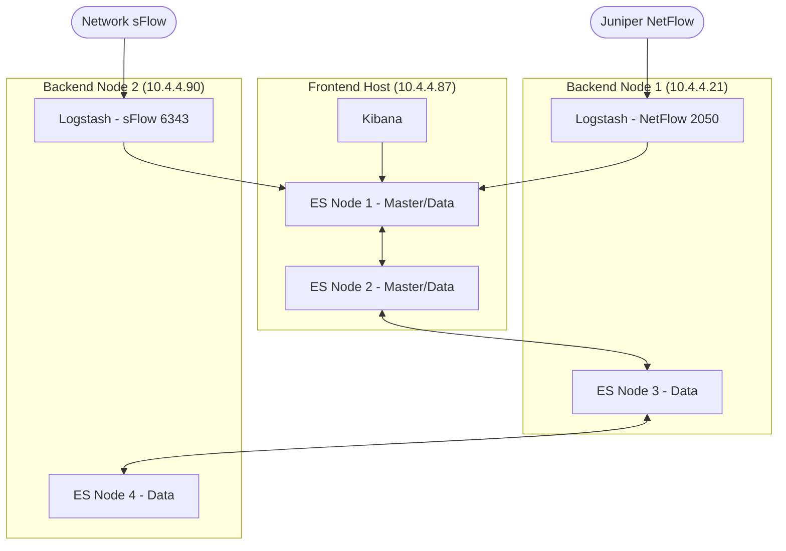

# ELK Production Deployment Documentation

This repository contains the configuration and architectural overview for the production ELK (Elasticsearch, Logstash, Kibana) stack, version **9.2.4**.

## 1. Architecture Overview

The cluster is distributed across three physical/virtual hosts, separating the frontend (User Interface & Orchestration) from the backend (Data Processing & Storage).

### Architecture Diagram



### Node Inventory

| Host IP | Role | Services | Ports |
| :--- | :--- | :--- | :--- |
| **10.4.4.87** | Frontend | 2x ES Nodes, Kibana | 9200, 9201, 5601 |
| **10.4.4.21** | Backend N1 | ES Data Node, Logstash | 9200, 2050 (NetFlow), 2332 (Mgmt) |
| **10.4.4.90** | Backend N2 | ES Data Node, Logstash | 9200, 6343 (sFlow) |

---

## 2. Server Preparation

All nodes run on Docker. The following system adjustments are mandatory before deployment.

### System Limits
Elasticsearch requires high `vm.max_map_count`.
```bash
# Apply temporarily
sysctl -w vm.max_map_count=262144

# Apply permanently
echo "vm.max_map_count=262144" >> /etc/sysctl.conf
```

### Folder Structure
Each node should follow this standard directory layout:
```bash
/opt/elk/
├── certs/          # CA and Wildcard SSL certificates
├── elasticsearch/
│   ├── data/       # Persistent storage (chmod -R 1000:1000)
│   └── config/     # elasticsearch.yml
├── logstash/
│   ├── pipeline/   # logstash.conf
│   └── config/     # logstash.yml
└── kibana/
    └── config/     # kibana.yml
```

### Certificate Deployment
We use a Corporate CA and a wildcard certificate for all nodes.
1. Place `ca.crt`, `wildcard.crt`, and `wildcard.key` in `/opt/elk/certs/`.
2. Ensure permissions allow the Docker users to read these files.
3. For Elasticsearch Transport (9300), the same wildcard cert is reused across the cluster.

---

## 3. Configuration Deep-Dive

### Clustering (Unicast)
We do not use multicast. Discovery is handled via `discovery.seed_hosts`. 

**Frontend ES Node Config (`elasticsearch.yml`):**
```yaml
cluster.name: production-elk
node.name: es-frontend-01
network.host: 0.0.0.0
discovery.seed_hosts: ["10.4.4.87", "10.4.4.21", "10.4.4.90"]
cluster.initial_master_nodes: ["es-frontend-01", "es-frontend-02"]

# Roles
node.roles: [ master, data, ingest ]

# Security
xpack.security.enabled: true
xpack.security.transport.ssl.enabled: true
xpack.security.transport.ssl.verification_mode: certificate
xpack.security.transport.ssl.key: /usr/share/elasticsearch/config/certs/wildcard.key
xpack.security.transport.ssl.certificate: /usr/share/elasticsearch/config/certs/wildcard.crt
xpack.security.transport.ssl.certificate_authorities: [ "/usr/share/elasticsearch/config/certs/ca.crt" ]
```

**Backend Data Node Config:**
Same as above, but set `node.roles: [ data ]` and ensure `cluster.initial_master_nodes` is **omitted** (it is only needed for the very first cluster bootstrap on master-eligible nodes).

---

## 4. Sampling & Normalization Logic

### NetFlow Handling (Juniper)
Our Juniper routers are configured with a **4096x** sampling rate. Raw NetFlow data in Logstash represents only 1/4096th of actual traffic. To visualize real throughput, we normalize this in the Logstash pipeline.

**Logstash Ruby Filter (`logstash.conf`):**
```ruby
filter {
  if [type] == "netflow" {
    ruby {
      code => "
        # Apply 4096 multiplier to bytes and packets
        if event.get('[netflow][in_bytes]')
          event.set('[netflow][normalized_bytes]', event.get('[netflow][in_bytes]').to_i * 4096)
        end
        if event.get('[netflow][in_pkts]')
          event.set('[netflow][normalized_packets]', event.get('[netflow][in_pkts]').to_i * 4096)
        end
      "
    }
  }
}
```
*Note: We store both raw and normalized fields for audit purposes.*

---

## 5. Troubleshooting Connectivity

If a node fails to join the cluster:

1. **Verify Unicast Connectivity:**
   From Backend N1, check if the Frontend is reachable on transport ports:
   ```bash
   curl -v telnet://10.4.4.87:9300
   ```
2. **Check SSL Handshake:**
   Verify that the certificates match and the CA is trusted. Look for `SSLHandshakeException` in the Elasticsearch logs:
   ```bash
   docker logs es-node-03 | grep -i "ssl"
   ```
3. **Cluster State Check:**
   Query the API from the frontend:
   ```bash
   curl -u elastic:PASSWORD -X GET "https://10.4.4.87:9200/_cluster/health?pretty" --cacert /opt/elk/certs/ca.crt
   ```

---

## 6. Dashboards Import/Export

### Exporting
1. Go to **Kibana > Stack Management > Saved Objects**.
2. Filter by `Dashboard`.
3. Select relevant dashboards and click **Export**. This generates an `export.ndjson` file.

### Importing
1. Go to **Kibana > Stack Management > Saved Objects**.
2. Click **Import** and upload the `.ndjson` file.
3. Ensure the Index Patterns match. If the IDs differ, Kibana will prompt you to map the imported objects to the existing production index patterns.

---

**Built with Precision for Production.**  
*Last Updated: February 2026*
